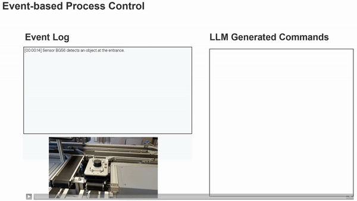

## Control Industrial Automation System with Large Language Models
This repository contains detailed information and video demonstration accompanying the paper titled "Control Industrial Automation System with Large Language Models", submitted to IEEE ICRA 2025.

A preprint of this paper is available on arXiv.
> Y. Xia, N. Jazdi, J. Zhang, C. Shah and M. Weyrich, Control Industrial Automation System with Large Language Models, 2024, arXiv preprint.

## Potential Use Case Demonstration:

## Prototypical Implementation in Laboratory Environment

Full video: Control Automation System with Large Language Models (2:58) https://youtu.be/GhBoxGfjRIE

## Event-Based Control:

## The System Design

## Model Fine-Tuning:
We apply supervised fine-tuning **(SFT)** to assess how training open-source models on the collected dataset improve the LLM’s performance for this specific downstream task. This training has the potential to enable the customization of a general LLM for intelligent control of specialized automation equipment. For GPT-4o, we use OpenAI’s proprietary fine-tuning API to explore the potential capabilities of LLMs, even though the training methods could be different.

>**Full fine-tuning (SFT):** Llama-3-70B-Instruct, Llama-3-8B-Instruct, Qwen2-7B-Instruct, Mistral-7Bx8-Instruct-v0.2, Mistral-7B-Instruct-v0.2
>
> Epochs: 1; Learning Rate: 1e-5; Batch Size: 16; Training Data Size: 0.2 million tokens

>**LoRA fine-tuning (SFT):** Qwen2-72B-Instruct
>
>LoRA-Rank: 32; LoRA-alpha: 32; Epochs: 1; Learning Rate: 1e-5; Batch Size: 16; Training Token Size: 0.2 million tokens

>**OpenAI’s API fine-tuning:** GPT-4o;
>
>Training Data Size: 0.2 million tokens

## Evaluation Results:
#### Evaluation of pre-trained LLM
We begin by evaluating the original pre-trained models. In automation tasks, 1) some are routine processes where the LLM agent can follow SOP guidelines in agent prompts to operate the automation system, while 2) others require the agent to autonomously respond to unexpected events, for which reactions have not been instructed in agent prompts. We distinguish between these two types of tasks in our evaluation.
Based on the evaluation results (the first 3 rows), GPT-4 generally outperforms other open-source models in interpreting agent prompts and events to generate control commands, though their performance varies significantly. Each model also exhibits distinct “personalities” in this use case.
#### Evaluation of post-trained LLM based on created dataset
Using the collected dataset, we apply supervised fine-tuning **(SFT)** to assess how training open-source models can improve the LLM’s performance for this specific downstream task (as indicated by the last three rows of data). This training has the potential to enable the customization of a general LLM for intelligent control of specialized automation equipment. For GPT-4o, we used OpenAI’s proprietary fine-tuning API to explore the capabilities that LLMs can achieve, even though the training methods may vary.

| Evaluation based on 100 test points | GPT-4o | Llama-3-70B-Instruct | Llama-3-8B-Instruct | Qwen2-72B-Instruct | Qwen2-7B-Instruct | Mistral-7Bx8-Instruct-v0.2 | Mistral-7B-Instruct-v0.2 |
|----------------------------------------|--------|----------------------|---------------------|--------------------|-------------------|-----------------------------|--------------------------|
| **Pre-trained (all)**                  | 81% \| 4.7 | 75% \| 4.3           | 37% \| 2.8          | 70% \| 4.0         | 65 \| 3.7         | 29% \| 2.4                  | 45% \| 2.9               |
| **Pre-trained (SOP)**                  | 100% \| 5.0 | 87% \| 4.5           | 53% \| 3.1          | 85% \| 4.5         | 63% \| 3.6        | 34% \| 2.4                  | 37% \| 2.5               |
| **Pre-trained (Unexpected)**           | 41% \| 4.0 | 50% \| 3.8           | 3% \| 2.2           | 38% \| 3.0         | 69% \| 4.0        | 19% \| 2.3                  | 63% \| 3.7               |
| **SFT (all)**                          | 100% \| 5.0 | 95% \| 4.8           | 96% \| 4.9          | * 66% \| 3.9       | 97% \| 4.9        | 45% \| 3.1                  | \*\*N.A.                 |
| **SFT (SOP)**                          | 100% \| 5.0 | 94% \| 4.8           | 99% \| 4.9          | * 82% \| 4.4       | 97% \| 4.9        | 61% \| 3.6                  | \*\*N.A.                 |
| **SFT (Unexpected)**                   | 100% \| 5.0 | 97% \| 4.9           | 91% \| 4.7          | * 31% \| 2.8       | 97% \| 5.0        | 9% \| 2.3                   | \*\*N.A.                 |

Notes:
- Values representation: (accuracy of their generated commands%) \| (averaged reason plausibility 1-5)
- Details of the evaluation data are organized in [evaluation_data.xlsx](evaluation_data.xlsx) 
- \* We ran out of GPU capacity and used LoRA instead of full fine-tuning for the Qwen2-72B model.
- \*\* N.A.: Our full-fine-tuning made Mistral-7B model unstable, and it generated unusable echo texts.

#### Insights
OpenAI’s model and fine-tuning services outperform other models, and the GPT-4o model quickly learns from the samples how to control the automation systems. Other models also demonstrated reasonably good performance. Interestingly, fine-tuned smaller LLMs did not necessarily underperform in this particular use case. However, our contingency LoRA fine-tuning yielded poor results in our experiments and led to a decrease in model performance.

## Technology Readiness Level (TRL)

## Other related papers
This research is a continuation of previous works:
> Y. Xia, M. Shenoy, N. Jazdi and M. Weyrich, **Towards autonomous system: flexible modular production system enhanced with large language model agents**, 2023 IEEE 28th International Conference on Emerging Technologies and Factory Automation (ETFA), Sinaia, Romania, 2023, pp. 1-8, doi: [10.1109/ETFA54631.2023.10275362](https://doi.org/10.1109/ETFA54631.2023.10275362). 

For a similar topic on **LLM agent system** and **simulation model**, one of our papers was acknowledged with the **Best Paper Award** at IEEE ETFA 2024, held on September 10-13, 2024 in Padova, Italy.
A preprint of this paper is available on arXiv.
> Y. Xia, D. Dittler, N. Jazdi, H. Chen and M. Weyrich, **LLM experiments with simulation: Large Language Model Multi-Agent System for Process Simulation Parametrization in Digital Twins**, 2024, arXiv preprint, https://doi.org/10.48550/arXiv.2405.18092.

Other similar works can be found at Google Scholar: https://scholar.google.de/citations?user=hi1srxkAAAAJ
