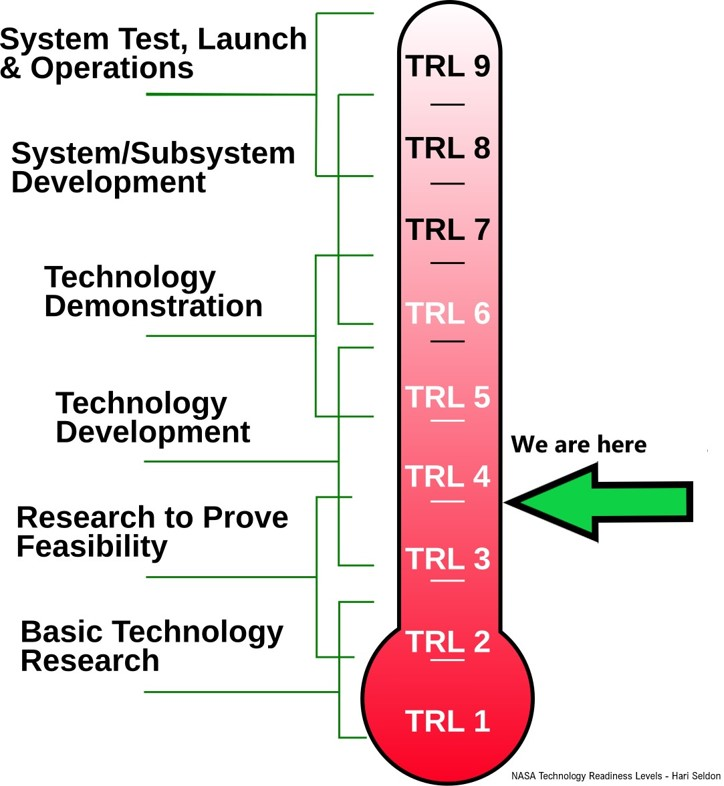

## Control Industrial Automation System with Large Language Models
This repository contains detailed information and video demostration accompanying the paper titled "Control Industrial Automation System with Large Language Models", submitted to IEEE ICRA 2025.

## Potential Use Case Demonstration:

## Prototypical Implementation in Laboratory Enviornment

Full video: Control Automation System with Large Language Models (2:54) https://youtu.be/fP7isjhrJ44

## Event-Based Control:

## The System Design

## Model Fine-Tuning:
We apply supervised fine-tuning **(SFT)** to assess how training open-source models on the collected dataset improves the LLM’s performance for this specific downstream task. This training has the potential to enable the customization of a general LLM for intelligent control of specialized automation equipment. For GPT-4o, we use OpenAI’s proprietary fine-tuning API to explore the potential capabilities of LLMs, even though the training methods could be different.

>**Full fine-tuning (SFT):** Llama-3-70B-Instruct, Llama-3-8B-Instruct, Qwen2-7B-Instruct, Mistral-7Bx8-Instruct-v0.2, Mistral-7B-Instruct-v0.2
>
> Epochs: 1; Learning Rate: 1e-5; Batch Size: 16; Training Data Size: 0.2 Million

>**LoRA fine-tuning (SFT):** Qwen2-72B-Instruct
>
>LoRA-Rank: 32; LoRA-alpha: 32; Epochs: 1; Learning Rate: 1e-5; Batch Size: 16; Training Token Size: 0.2 Million

>**OpenAI’s API fine-tuning:** GPT-4o;
>
>Training Data Size: 0.2 Million

## Evaluation Results:
| Evaluation based on 100 test points | GPT-4o | Llama-3-70B-Instruct | Llama-3-8B-Instruct | Qwen2-72B-Instruct | Qwen2-7B-Instruct | Mistral-7Bx8-Instruct-v0.2 | Mistral-7B-Instruct-v0.2 |
|----------------------------------------|--------|----------------------|---------------------|--------------------|-------------------|-----------------------------|--------------------------|
| **Pre-trained (all)**                  | 81% \| 4.7 | 75% \| 4.3           | 37% \| 2.8          | 70% \| 4.0         | 65 \| 3.7         | 29% \| 2.4                  | 45% \| 2.9               |
| **Pre-trained (SOP)**                  | 100% \| 5.0 | 87% \| 4.5           | 53% \| 3.1          | 85% \| 4.5         | 63% \| 3.6        | 34% \| 2.4                  | 37% \| 2.5               |
| **Pre-trained (Unexpected)**           | 41% \| 4.0 | 50% \| 3.8           | 3% \| 2.2           | 38% \| 3.0         | 69% \| 4.0        | 19% \| 2.3                  | 63% \| 3.7               |
| **SFT (all)**                          | 100% \| 5.0 | 95% \| 4.8           | 96% \| 4.9          | * 66% \| 3.9       | 97% \| 4.9        | 45% \| 3.1                  | \*\*N.A.                 |
| **SFT (SOP)**                          | 100% \| 5.0 | 94% \| 4.8           | 99% \| 4.9          | * 82% \| 4.4       | 97% \| 4.9        | 61% \| 3.6                  | \*\*N.A.                 |
| **SFT (Unexpected)**                   | 100% \| 5.0 | 97% \| 4.9           | 91% \| 4.7          | * 31% \| 2.8       | 97% \| 5.0        | 9% \| 2.3                   | \*\*N.A.                 |

Notes:
- Values representation: (accuracy of their generated commands%) \| (averaged reason plausibility 1-5)
- Details of the evaluation data is organized in [evaluation_data.xlsx](evaluation_data.xlsx) 
- \* We ran out of GPU capacity and used LoRA instead of full fine-tuning for the Qwen2-72B model.
- \*\* N.A.: Our full-fine-tuning made Mistral-7B model unstable, and it generated unusable echo texts.

## Technology Readiness Level (TRL)

